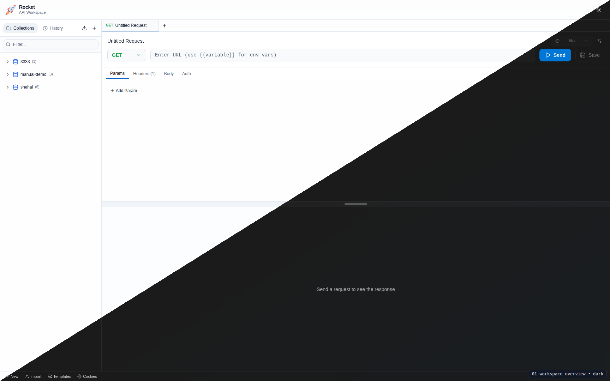

<p align="center">
  
</p>

<h1 align="center">Rocket</h1>

<p align="center">
  Modern API testing workspace inspired by Bruno. Fast local workflow, file-based collections, and clean team-friendly collaboration.
</p>

<p align="center">
  
  
  
  
  
</p>

<p align="center"><strong>Frontend:</strong> http://localhost:5173 • <strong>Backend:</strong> http://localhost:8080/api/v1</p>

<p align="center">
  
</p>

## Why Rocket

- Bruno-compatible, file-based request workflow (`.bru`)
- Collection, folder, and request organization
- Multi-tab request editing
- Collection variables and environments
- History, templates, and cookie tools
- Light and dark themes

## Quick Start

### Prerequisites

- Node.js 18+
- Yarn
- Go 1.21+

### 1. Start Backend

```bash
cd backend
go mod download
go run cmd/server/main.go
```

Backend endpoints:
- API: `http://localhost:8080/api/v1`
- Health: `http://localhost:8080/health`

### 2. Start Frontend

```bash
cd frontend
yarn install
yarn dev
```

Frontend:
- App: `http://localhost:5173` (or next free Vite port)

## Project Layout

```text
rocket-api/
├── frontend/        # React + Vite app
├── backend/         # Go API server
├── collections/     # Example Bruno-style collections
├── docs/            # User/admin manuals and plans
└── scripts/         # Utility scripts (including screenshot capture)
```

## Documentation

- User Manual: `docs/user-manual.md`
- Admin/Developer Manual: `docs/admin-developer-manual.md`
- Manual assets guide: `docs/manual-assets/README.md`
- Screenshot manifest: `docs/manual-assets/screenshot-manifest.md`

## Useful Commands

Frontend:
```bash
cd frontend
yarn lint
yarn test
yarn build
```

Backend:
```bash
cd backend
go test ./...
```

Screenshot workflow:
```bash
./scripts/capture-manual-screenshots.sh --help
```

## License

MIT
