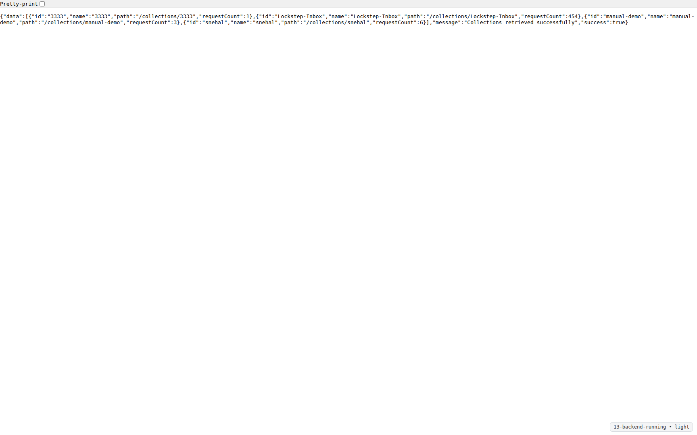
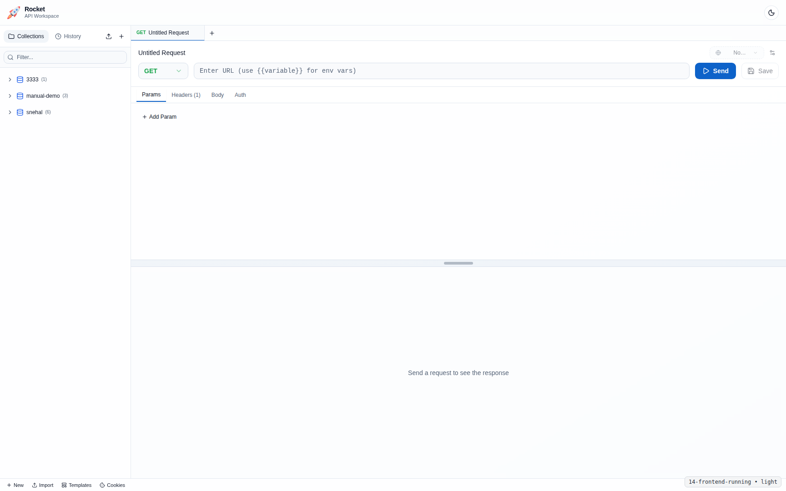
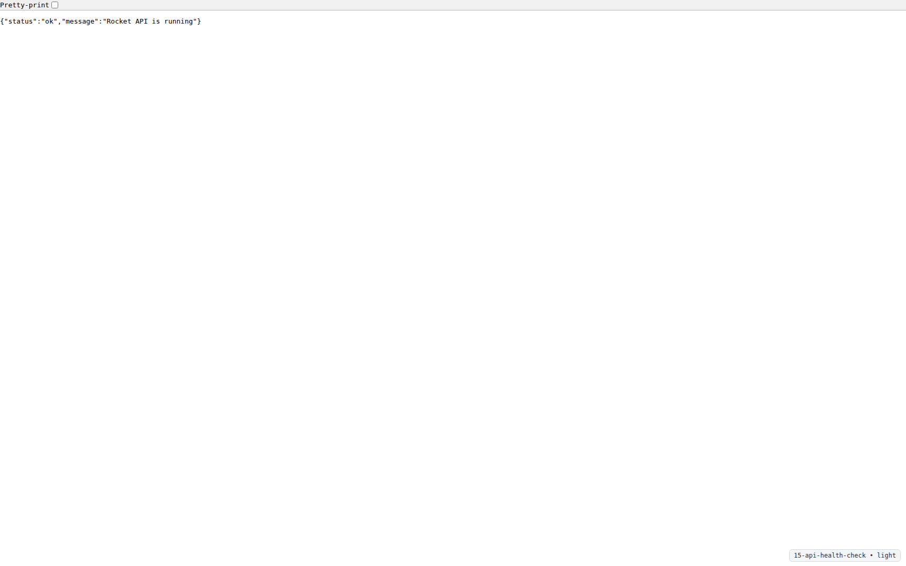
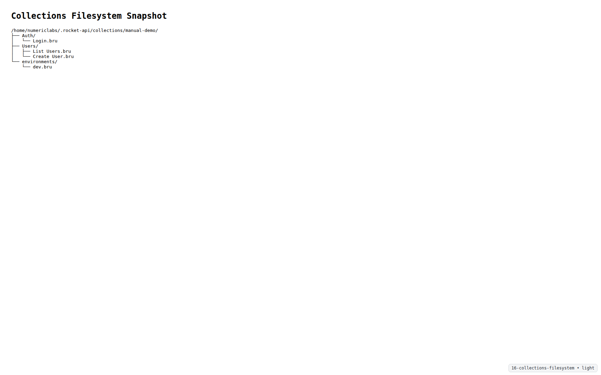
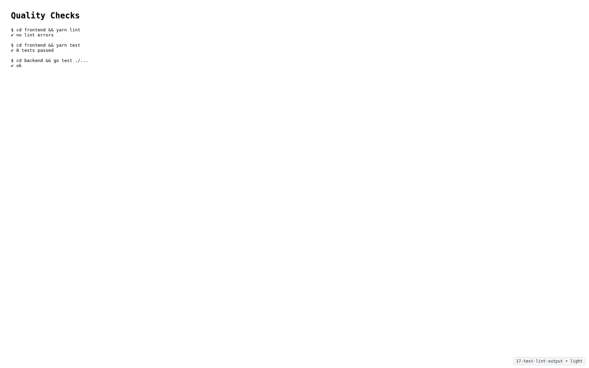
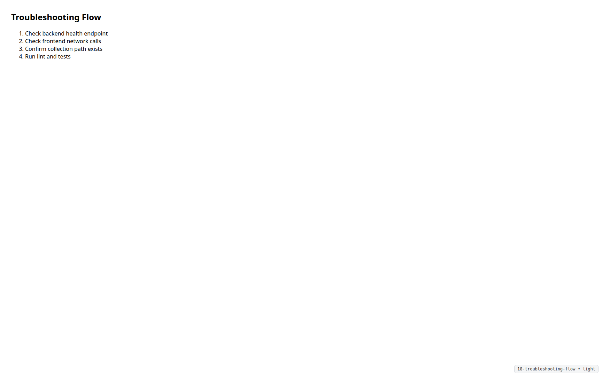

# Rocket Admin & Developer Manual

This manual covers installation, local development, configuration, backend/frontend operations, and troubleshooting.

## 1. Architecture Overview

Rocket is split into:
- `frontend/`: React + Vite UI
- `backend/`: Go API service
- `collections/`: file-based request collections

Primary ports:
- Frontend: `http://localhost:5173`
- Backend API: `http://localhost:8080`
- Health: `http://localhost:8080/health`

## 2. Prerequisites

- Node.js 18+
- Yarn
- Go 1.21+

## 3. Install and Run

### 3.1 Frontend
```bash
cd frontend
yarn install
yarn dev
```

### 3.2 Backend
```bash
cd backend
go mod download
go run cmd/server/main.go
```

### 3.3 Health Check
```bash
curl -i http://localhost:8080/health
```

Expected: HTTP 200 and healthy status.





## 4. Configuration Notes

- Frontend API base URL is configured in `frontend/src/lib/api.ts`.
- Current default backend URL is `http://localhost:8080/api/v1`.
- Theme persistence key is `rocket-theme` in localStorage.
- Request tab/session persistence key is `rocket-api:tabs-session:v1` in localStorage.

### 4.1 Script Runtime Notes

- Request execution supports pre-request and post-response scripts.
- Runtime is backend sandboxed JavaScript execution with TS transpilation path.
- Supported script aliases: `pm.*` and `bru.*`.
- Runtime intentionally blocks direct filesystem/process/module access.
- Script execution timeout is enforced to prevent infinite loops.

## 5. Data and Collection Storage

Collections are file-based and live under workspace collection paths.



Operational notes:
- Keep collection files in version control when possible.
- Ensure write permissions on collection folders.

## 6. Quality and Validation Commands

From `frontend/`:
```bash
yarn lint
yarn test
yarn build
```

From `backend/`:
```bash
go test ./...
```



## 7. Screenshot Workflow (Both Themes)

### 7.1 Output Paths
- Raw Light: `docs/manual-assets/screenshots/light/`
- Raw Dark: `docs/manual-assets/screenshots/dark/`

### 7.2 Manifest
Use `docs/manual-assets/screenshot-manifest.md` as the capture checklist.

### 7.3 Capture Script
```bash
./scripts/capture-manual-screenshots.sh --help
```

The script scaffolds deterministic filenames and supports an auto-capture path when Playwright is installed.

## 8. Troubleshooting (Admin/Developer)



### 8.1 Frontend cannot reach backend
- Confirm backend process is running.
- Confirm port `8080` is free and reachable.
- Check browser devtools network for CORS or connection errors.

### 8.2 Duplicate API calls in dev
- React StrictMode may double-run effects in development.
- Store-level dedupe guards should coalesce concurrent fetches.

### 8.3 Collection tree inconsistency
- Trigger collection refresh.
- Validate `.bru` file structure and path conventions.

## 9. Maintenance Checklist

Before release:
1. Run lint/tests/build (frontend + backend).
2. Verify critical flows in light and dark themes.
3. Refresh manual screenshots if UI changed.
4. Ensure screenshot files and paths are up to date with current UI.
