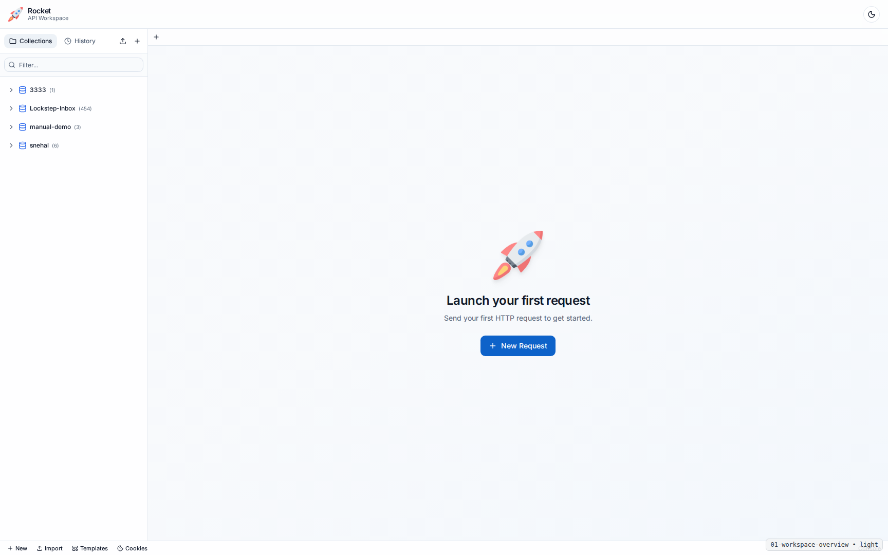
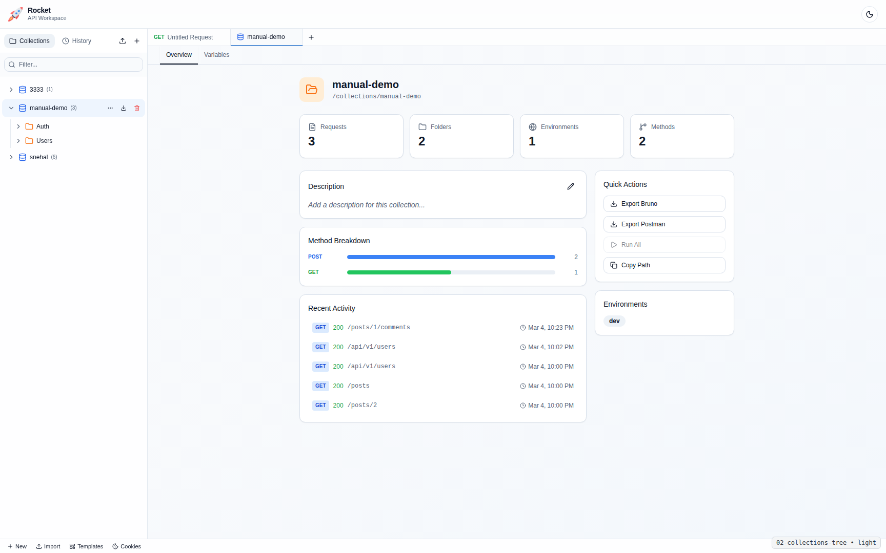
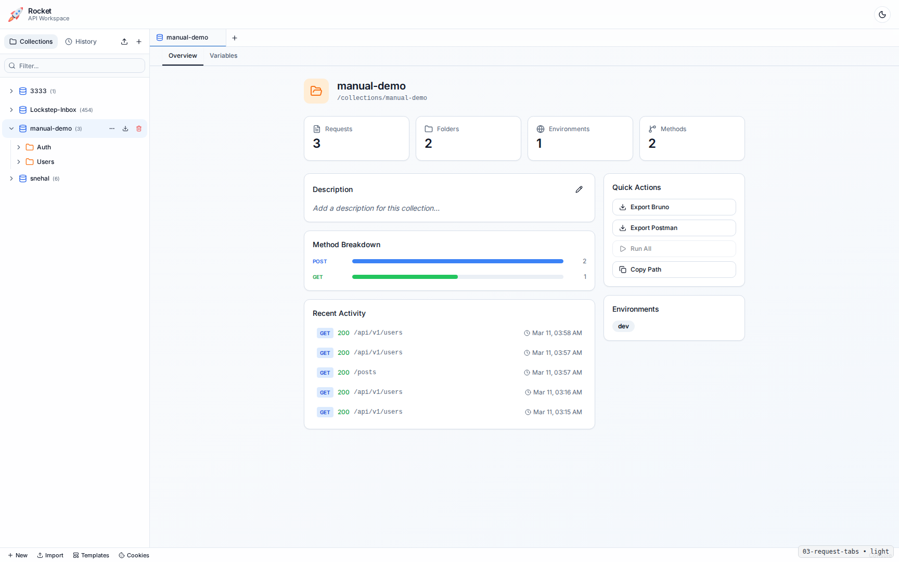
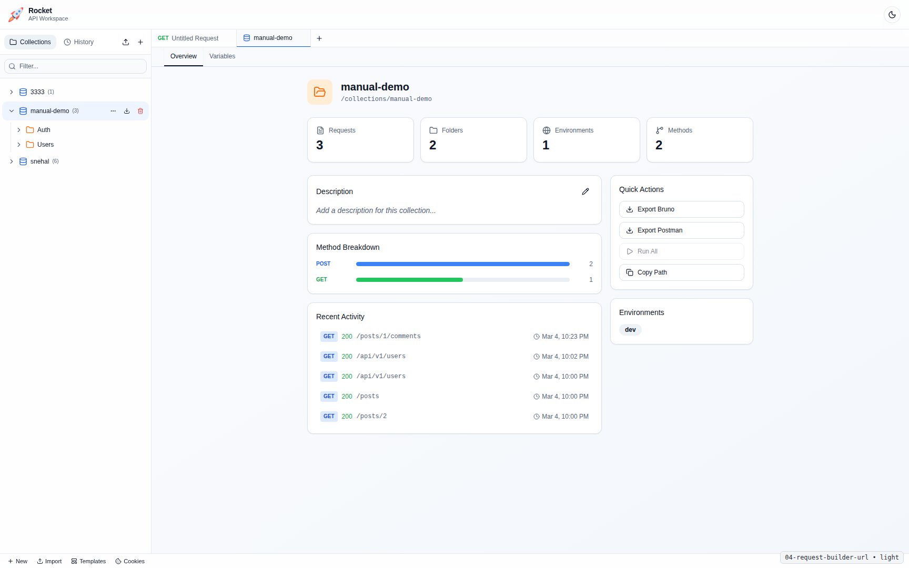
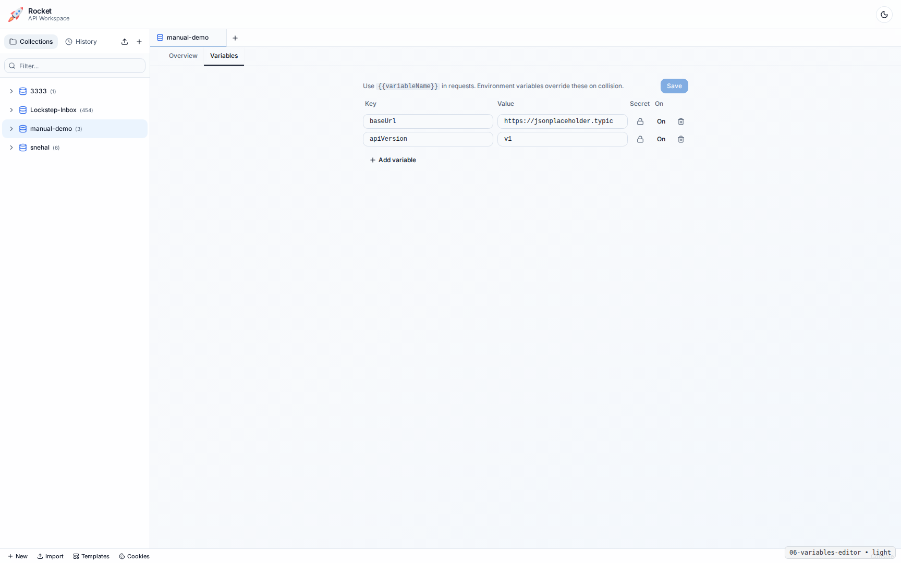
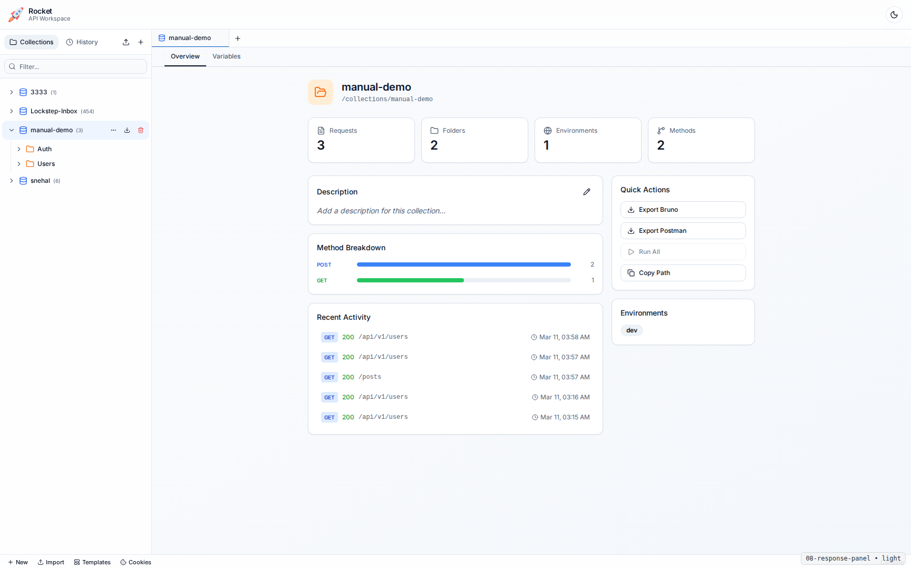
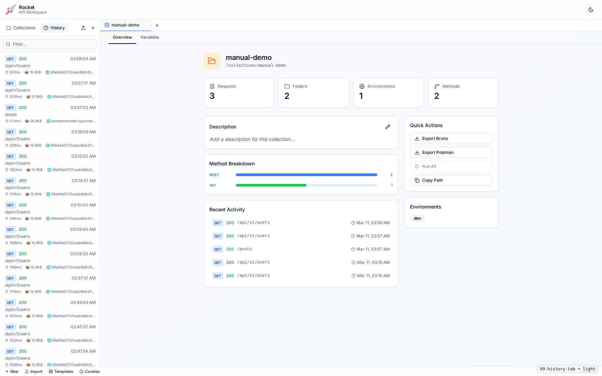
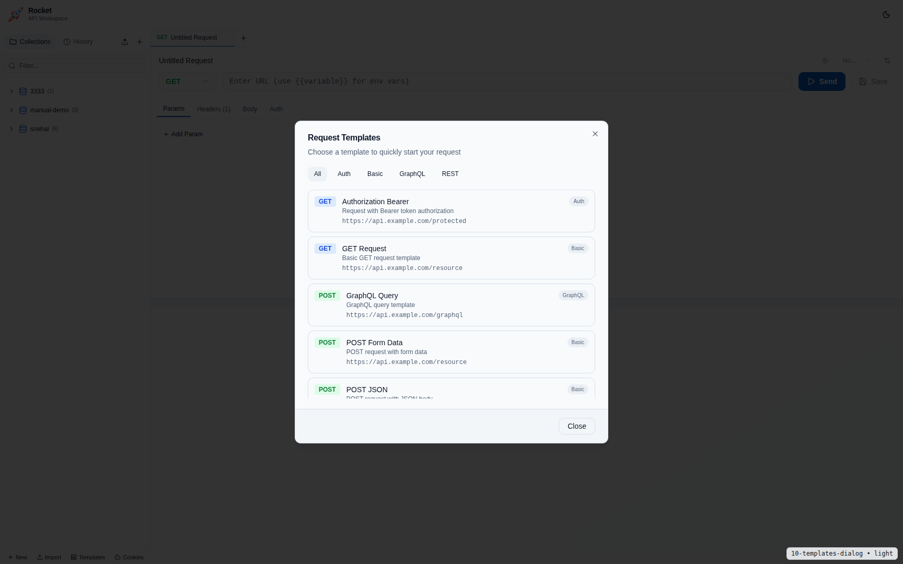
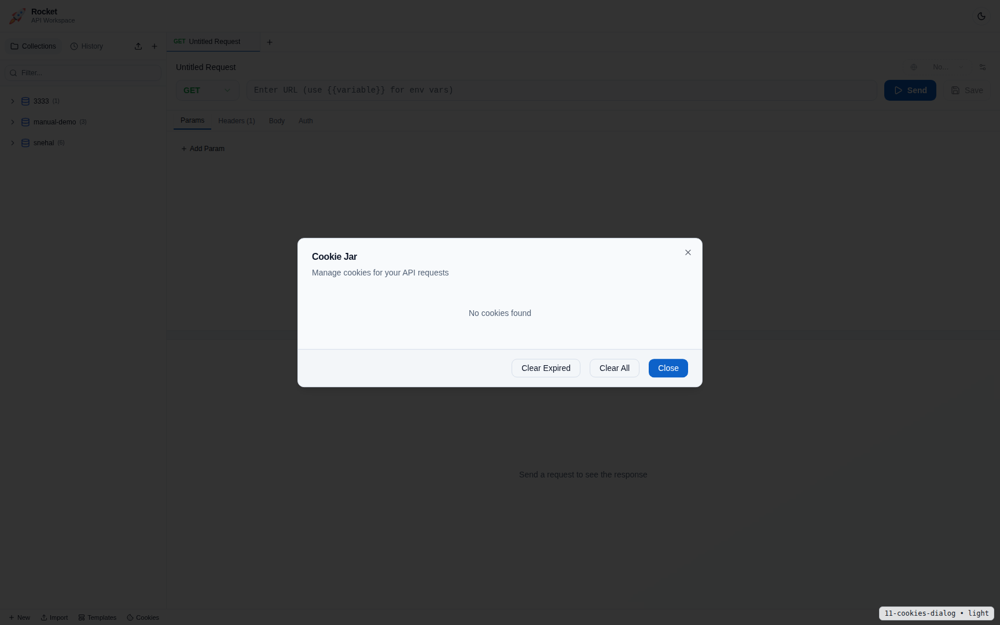
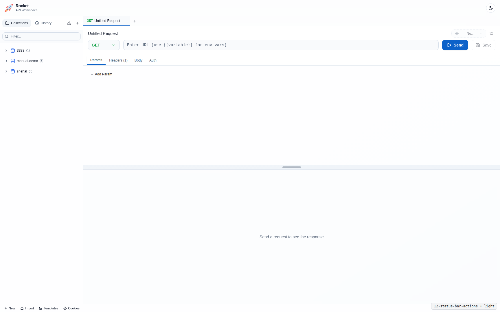

# Rocket User Manual

This manual explains the end-user features available in Rocket and how to use them.

## 1. What Rocket Supports

Rocket supports:
- Collection-based API request management
- Folder and request organization (Postman/Bruno style)
- Multi-tab request editing and collection overview tabs
- HTTP methods, headers, query params, auth, and request body editing
- Request-level scripts (pre-request and post-response)
- Environment + collection variables
- Request history
- Request templates
- Cookie jar management
- Theme support (Light and Dark)

## 2. Workspace Overview

## 3. Collections, Folders, and Requests

### 3.1 Create a Collection
1. Click `New` in the global status bar.
2. Enter collection name.
3. Click `Create`.

### 3.2 Create Folder/Request
1. Open collection menu (`...`).
2. Select `New Folder` or `New Request`.
3. Provide name and confirm.

### 3.3 Open Behavior
- Clicking a request opens it in a new tab if not already open.
- Clicking an already-open request focuses the existing tab.

## 4. Request Tabs

- Multiple requests can stay open simultaneously.
- Active tab selection syncs with sidebar selection.
- Save operations target the originating tab/request.

## 5. URL and Request Builder

### 5.1 URL Variables
- Use `{{variableName}}` in URL.
- Hover variable token to open inline popout editor.
- Save updates active environment variable first; fallback is collection variable.

## 6. Headers, Query, Body, Auth

Rocket supports body modes:
- `none`
- `json`
- `raw`
- `form-data`
- `binary`

## 6.1 Scripts

- Open the `Scripts` tab in Request Builder.
- Use `Pre-request script` to modify outgoing request data (headers/body/url/variables) before send.
- Use `Post-response script` to run checks after response is received.
- Choose script language (`JavaScript` or `TypeScript`) from the language selector.

Script APIs:
- Postman-style: `pm.*`
- Bruno-style: `bru.*`

Current sandbox constraints:
- No direct filesystem or process access.
- No module import/require support.
- Script runtime has execution timeout limits.

## 7. Collection Variables

- Open collection overview tab.
- Switch to `Variables` tab.
- Add/edit keys and values.
- Mark secret or enable/disable variables.
- Click `Save`.

## 8. Environments

- Create per-collection environments.
- Use environment variables to override collection variables.
- Switch active environment to test different targets.

## 9. Send Request and Analyze Response

Response area provides:
- Status code and status text
- Timing and payload size
- Headers and body viewer

## 10. History

- Open `History` tab in sidebar.
- Click any history item to load it into active request tab.

## 11. Templates

- Click `Templates` in status bar.
- Pick template category and template.
- Template loads into active request tab.

## 12. Cookies

- Click `Cookies` in status bar.
- View by domain, delete specific cookies, clear expired/all.

## 13. Status Bar Actions

Quick actions:
- `New`
- `Import`
- `Templates`
- `Cookies`

## 14. Troubleshooting (User)

- Request fails to send:
  - Ensure backend is running on `http://localhost:8080`.
- Collection not visible:
  - Reload app, confirm collection exists under workspace collections directory.
- Variables not updating:
  - Ensure you are on the intended collection overview tab and clicked `Save`.

## 15. Screenshot Coverage

Raw screenshots for both themes are tracked in:
- `docs/manual-assets/screenshot-manifest.md`
